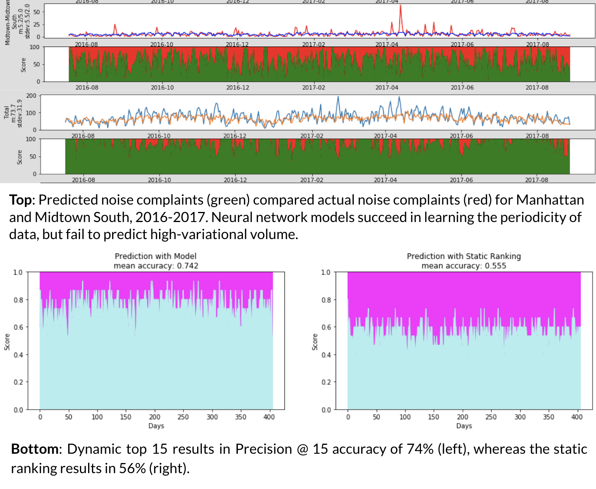

# Using PyTorch for Noise Volume Forecasting
### [Data Cleansing](https://github.com/sunghoonyang/noise-capstone/blob/master/analysis/311/nn/vanilla_lstm_model-NTA-MN_ONLY_data_wrangling.ipynb)
This notebook stores sequential scripts that generate training/test data for NN. 
### [NN with Under-complete Autoencoder](https://github.com/sunghoonyang/noise-capstone/blob/master/analysis/311/nn/LSTM_AEDE_model.ipynb)
We selected using Autoencoder approach to encode meaningful patterns in sequence through compression of information, hence encoding. The data that has daily batch shaped as 29 neighborhoods by the number of features is collapsed as an one-dimensional  array and fed to some type of RNN for pattern recognition. LSTM model was chosen as the best performer out of RNN and LSTM, and was employed as the first layer of an under-complete autoencoder/decoder pair, with two densenets two reduce dimensionality by 50% at each step, before recovering it again from 25% to 100% through the decoder that is of the same architecture as the encoder, but with increasing dimensionality to the correct output dimensionality for the final projection to the target space. The model employs normalization of data and introduction of healthy noise using batch normalization and dropout procedures. Batch normalization is used for all linear layers, while dropout was used for LSTM layers. Softmax layer is used to output pseudo-probability density of complaint volume of each spatial bin on each day, which allowed us to rank the neighborhoods by probability and compute the Precision @ 15 accuracy metric.
```python
class ManhattanModel(nn.Module):
        def __init__(self, input_dim, feature_dim, hidden_dim, output_dim, num_layers, batch_size):
            '''
            The model uses LSTM model as both Encoder/Decoder for this undercomplete Autoencoder model.
            * Batch normalization is used for all linear layers.
            * The autoencoder compresses the representation to hidden_dim/4, 
                and then recovers the dimensionality back to hidden_dim
            * Softmax layer is used to output pseudo-probability density of complaint volume 
                of each spatial bin on each day.
            '''
            super(ManhattanModel, self).__init__()
            self.input_dim = input_dim
            self.feature_dim = feature_dim        
            self.hidden_dim = hidden_dim
            self.output_dim = output_dim        
            self.batch_size = batch_size
            self.num_layers = num_layers
            self.lstm1 = nn.LSTM(
                input_dim*feature_dim
                , self.hidden_dim
                , self.num_layers
                , dropout=0.1
                , batch_first=True
            )
            self.batchnorm1d_1 = nn.BatchNorm1d(batch_size)            
            self.linear_1 = nn.Linear(self.hidden_dim, int(self.hidden_dim/2))
            self.batchnorm1d_2 = nn.BatchNorm1d(batch_size)   
            self.linear_2 = nn.Linear(int(self.hidden_dim/2), int(self.hidden_dim/4))
            self.lstm2 = nn.LSTM(
                int(self.hidden_dim/4)
                , self.hidden_dim
                , self.num_layers
                , dropout=0.1
                , batch_first=True
            )
            self.batchnorm1d_3 = nn.BatchNorm1d(batch_size)    
            self.linear_3 = nn.Linear(self.hidden_dim, int(self.hidden_dim/2))
            self.batchnorm1d_4 = nn.BatchNorm1d(batch_size)    
            self.linear_4 = nn.Linear(int(self.hidden_dim/2), output_dim)        
            
        def init_hidden(self):
            # This is what we'll initialise our hidden state as
            return (torch.zeros(self.num_layers, self.batch_size, self.hidden_dim),
                    torch.zeros(self.num_layers, self.batch_size, self.hidden_dim))
    
        def forward(self, x, h1, h2):
            if h1 is None:
                x, h1 = self.lstm1(x)
            else:
                x, h1 = self.lstm1(x, h1)
            x = self.batchnorm1d_1(x)
            x = self.linear_1(x)
            x = F.relu(x)
            x = self.batchnorm1d_2(x)
            x = self.linear_2(x)   
            x = F.relu(x)        
            if h2 is None:
                x, h2 = self.lstm2(x)
            else:
                x, h2 = self.lstm2(x, h2)
            x = self.linear_3(x)  
            x = self.batchnorm1d_3(x)
            x = F.relu(x)        
            x = self.batchnorm1d_4(x)
            x = self.linear_4(x)  
            x = F.relu(x)  
            x = F.softmax(x, dim=-1)
            return x, h1, h2
```
The result was presented in Precision @ 15 metric, where the correctly predicted membership of top 15 neighborhoods out of 29 candidates is counted as score out of 15. The result of Precision @ 15 is visualized in bottom graph, when tested with 2 years worth of held-out data.

